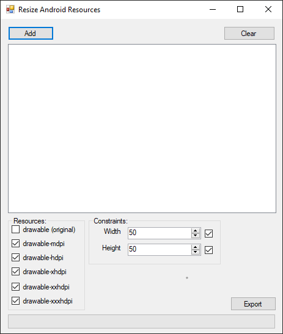

# AndroidResourceResizingTool
Is a tool that allow you to resize the original resources to specific Android screen dimensions.

# Download
You can download the lastest release from [here](https://github.com/M4rYu5/AndroidResourceResizingTool/releases/download/v1.0/AndroidResourceResize.rar "Latest release")
  or go to [releases](https://github.com/M4rYu5/AndroidResourceResizingTool/releases) to find more.

# Screenshot

